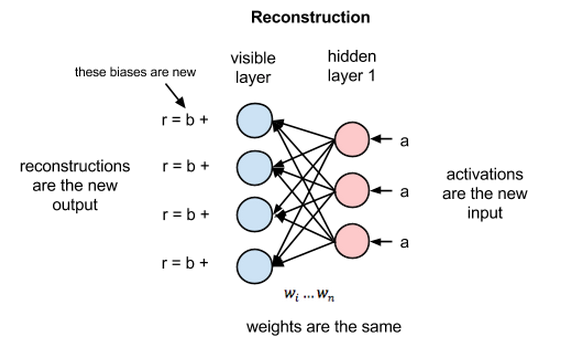

<h1 style="text-align:center">RBM Experiment</h1>

<h3 style="text-align:center">朱祺 2014011336 <a href="mailto:zhu-q14@mails.tsinghua.edu.cn">zhu-q14@mails.tsinghua.edu.cn</a></h3>

[TOC]

## 实验要求

构造一个RBM，对Test数据集中的手写体数字进行分类。

1. 训练集中的数据为未标注的原始数据，在使用之前建议对该数据集进行一些处理，使其适应于RBM的需要；
2. 原始数据处理的一个重要目标是降低输入单元的数量；
3. 可以采用网上下载、自己构造的方法，增加训练集的数量；
4. 可以两人组队，但需要说明分工。
5. 作业需要交代码和文档，实验报告。


## RBM 简介

### 结构

受限玻尔兹曼机（RBM）由Geoff Hinton发明，是一种用于降维、分类、回归、协同过滤、特征学习和主题建模的算法。它是无监督的，**最核心的思想是对数据进行变换（压缩或扩展）后，能尽可能地保留原始数据的信息，重构出的数据与原始数据差异越小越好。**结构和重构过程图解如下：




### 概率与能量模型

RBM是一种能量模型，从能量函数的定义出发，能推导出以下两个式子：
$$
p(h_i=1|v)=\sigma(\sum_{j=1}^mw_{ij}*v_j+c_i)\\
p(v_i=1|h)=\sigma(\sum_{i=1}^nw_{ij}*h_i+b_j)\\
$$
第一个式子：对于给定的可见层 v，隐藏层 h 的第 i 个节点的取值为1（编码后的样本的第i个特征的取值为1）的概率。第二个式子正好反过来，是给定 h ，v 第 i 个节点取值为1的概率。权值 W 是共用的，h 和 v 的 bias 不同。

### 采样与训练

采样方式有三种：Gibbs，CD-k，PCD。主要的思想是来回采样以确定训练的梯度。如下图：


### 应用

1. 降维。对数据进行编码，然后交给监督学习方法去进行分类或回归
2. BP神经网络初始化训练。初始值选得不好的话，往往会陷入局部极小值。根据实际应用结果表明，直接把RBM训练得到的权重矩阵和偏移量作为BP神经网络初始值，得到的结果会非常地好。
3. RBM可以估计联合概率p(v,h)，如果把v当做训练样本，h当成类别标签（隐藏节点只有一个的情况，能得到一个隐藏节点取值为1的概率），就可以利用利用贝叶斯公式求p(h|v)，然后就可以进行分类，类似朴素贝叶斯、LDA、HMM。说得专业点，RBM可以作为一个生成模型（Generative model）使用。
4. RBM可以直接计算条件概率p(h|v)，如果把v当做训练样本，h当成类别标签（隐藏节点只有一个的情况，能得到一个隐藏节点取值为1的概率），RBM就可以用来进行分类。说得专业点，RBM可以作为一个判别模型（Discriminative model）使用。


## 实验环境

mac Sierra 10.12.4

python 2.7.10：

* numpy (1.12.1)
* scikit-learn (0.18.1)

目录结构：

- dataset
  - TEST：测试集
  - TRAIN：训练集
  - *.npz：数据预处理后的训练集和测试集
  - mnist.pkl.gz：用于验证实验
- src
  - preprocess.py：数据预处理
  - RBM.py：模型构建，训练，测试
- report
  - report.pdf：报告
  - result.txt：**结果输出**
- README.md：代码使用说明


## 数据预处理

### 数据格式

每个文件夹 180 个图片，组成如下：

- 10 label (1-10)
- 3 kind (3 pattern each number)
- 6 version (6 kind of noise)

各个文件夹的格式：

- digits:
  - `(label)_(index1).png[_n(index2).png]`：e.g. `0_1.png_n1.png`
  - index1: 该label第几个数字
  - index2: 第几个噪声版本
- hjk_picture:
  - `(index1).(label).png[_n(index2).png]`：`1.0.png_n1.png`
  - `(label)_(index1).png[_n(index2).png]`：`5_2.png_n1.png`
  - 例外情况：`2.9png.png_n1.png` 
- Li Wanjin
  - `(label).jpg[_n(index2).png]`：`0.jpg_n1.png`
  - `(index1)-(label).jpg[_n(index2).png]`：`1-0.jpg_n1.png`
- number
  - `(index1).(label).png[_n(index2).png]`：`1.0.png_n1.png`


- TEST
  - `(index)\[(label)\].png`：`0[7].png`

可以看到格式不统一，但还是有迹可循

### 预处理

主要处理函数：`preprocess.py:load_data(data_dir)`

```python
read pic from dir
:param data_dir
:return: (X,y) X: np.array(dataset_size, 32*32, dtype = float64);
                y: np.array(dataset_size, , dtype = int64);
```

大部分图片都是(32,32)的灰度图，有一些是(32, 32, 3)的RGB，(32, 32, 4)的RGBA，以及(32, 35, 4)的不标准图片。对RGB通道取均值，(32, 35, 4)的取[:, 1:33]。

运行 `preprocess.py` 将在 `dataset` 目录下生成 `data[0-4].npz` 和 `test.npz` ，对应训练集和测试集。

在`RBM.py:load_all`中，解析`*.npz` 返回训练集测试集。

在`RBM.py:scale`中将[0,255]缩放到[0,1]区间，直接除以255。

处理完后的数据：

- trainX: (720, 1024) 取值 [0, 1]
- trainY: (720, ) 取值 [0-9]
- testX: (100, 1024) 取值 [0, 1]
- testY: (100, ) 取值 [0-9]

## 分类模型

RBM是一种无监督模型，本身没有分类功能。用RBM来判别的三种方法是：

1. 用RBM学到的隐层特征作为一些标准判别模型的输入
2. 对每个类训练一个RBM，之后再接一个softmax层
3. 把特征向量和标签作为RBM的可视层输入，训练RBM作为特征向量和标签的生成模型

第一种实现简单，模块分离，而且效果不错，因此实验中采用第一种方法。

模型设置分为三部分：第一部分是baseline，标准的分类模型。第二部分是RBM+classifier，**训练好一层后，将变换后的数据传入下一层**，还有RBM+RBM+classifier，想看看降到同一维度是多个RBM好还是单个RBM好。第三部分是常用降维算法PCA+分类器，用于和RBM比较降维的效果。

### Baseline

- Logistic Regression
- SVC
- Multi-Layer Perceptron 

### RBM

- RBM+LR
- RBM+SVC
- RBM+MLP
- RBM+RBM+LR

### PCA

- PCA+LR
- PCA+SVC
- PCA+MLP
- PCA+PCA+LR

### 实现&超参数设置

借助 `sklearn` 提供的相关函数：

```python
from sklearn.model_selection import train_test_split
from sklearn.model_selection import GridSearchCV
from sklearn.metrics import classification_report
from sklearn.linear_model import LogisticRegression
from sklearn.svm import SVC
from sklearn.neural_network import BernoulliRBM, MLPClassifier
from sklearn.pipeline import Pipeline
from sklearn.decomposition import PCA
```

其中 `Pipeline` 用于将一系列变换 (RBM/PCA) 与最终分类 (LR/SVC/MLP) 接在一起。

`GridSearchCV` 用于参数调整，示例用法可参见 `find_hyperparameter`

- RBM 和 PCA **隐层单元**（降维后维度）的数目设定为 **200**。依据是 Hinton 的 "A Practical Guide to Training Restricted Boltzmann Machines", 要比训练样本低一个数量级，试验后发现 200 效果比较好。
- RBM+RBM, PCA+PCA 的隐层单元设置为 (600,200)
- 为方便对比，MLP 隐层单元数也设为 200
- RBM+MLP，PCA+MLP，MLP 隐层单元数设为 50
- LR、SVC的超参数及其他参数略


## 结果分析

使用 sklearn 中 `classification_report` 生成分类结果报告，见 **`report/result.txt`**

| Model      | avg_precision | avg_recall | f1-score | parameter  |
| ---------- | ------------- | ---------- | -------- | ---------- |
| LR         | 1.00          | 1.00       | 1.00     | C=1.0      |
| SVC        | 1.00          | 1.00       | 1.00     | C=1.0      |
| MLP        | 1.00          | 1.00       | 1.00     |            |
| RBM+LR     | 1.00          | 1.00       | 1.00     | LR.C=1e5   |
| PCA+LR     | 1.00          | 1.00       | 1.00     | LR.C=1.0   |
| RBM+SVC    | 1.00          | 1.00       | 1.00     | SVC.C=2000 |
| PCA+SVC    | 1.00          | 1.00       | 1.00     | SVC.C=1.0  |
| RBM+MLP    | -             | -          | -        |            |
| PCA+MLP    | 1.00          | 1.00       | 1.00     |            |
| RBM+RBM+LR | 0.93          | 0.93       | 0.93     | LR.C=1e8   |
| PCA+PCA+LR | 1.00          | 1.00       | 1.00     | LR.C=1.0   |

MLP 的 learning_rate_init=.001。RBM+MLP 因为 MLP 的 loss 下不去，无法训练出有效的模型。

对上述结果进行分析：

* 从总体上看，各个分类模型（除RBM+MLP）都能取得较好的效果，考虑到数据比较少（训练样本720，测试样本100），说明数据的分布比较好。从另一个角度看，训练数据少也说明模型的泛化能力可能较弱。因为各个模型都能在测试集上达到百分百准确，**所以无法仅从结果上比较模型的好坏**，准确率对于模型的分析提供的帮助也很有限。

* 首先只看和 RBM 有关的模型。RBM+classifier 效果还是不错的，调参后都能到100%准确，说明RBM的降维能保留类在判别空间的可分性，印证了RBM简介中提到的应用1。

* 分类时 RBM 相当于降维，因此和标准的降维算法 PCA 比较，对我们了解 RBM 有很大的帮助。可以看到，在相同的条件设置下，**PCA 的效果都不会弱于 RBM**，且 PCA 型分类器更快。

  * LR 和 SVC 的 C 越小，正则化越强，可以看到为了达到较高的准确率，RBM+LR、RBM+SVC 的参数 C 都很大，有过拟合的倾向，而 PCA+LR、PCA+SVC 的参数 C 则和直接用 LR、SVC 的参数 C 相同，相比之下都很小。
  * RBM+MLP 训练不出来，PCA+MLP 则能达到100%准确率。
  * PCA+PCA+LR 准确率高于 RBM+RBM+LR

  从 PCA 和 RBM 的对比中，可以得出以下结论：在**数据量较小**的情况下，RBM的降维效果不如PCA，得到的新的特征的可分性要弱于PCA，需要更强的分类器才能达到差不多的效果。对此的一个猜想是：**数据量太小使得RBM没有得到充分的训练**。下一节中将用实验验证这个猜想。

* 使用 RBM+RBM+LR 的效果准确率也接近100%，但是别的模型是100%因为最高是100%，而 RBM+RBM+LR 是因为只能到93%。和 RBM+LR 相比，RBM+RBM+LR 效果不好说明两层RBM损失的信息多于一层，**层数并不是越多越好**，毕竟每次降维都有信息损失。


## 验证实验

在结果分析一节中，发现在**数据量较小**的情况下，RBM的降维效果不如PCA。对此的一个猜想是：**数据量太小使得RBM没有得到充分的训练**。为了验证这个猜想，我使用mnist数据集进行**训练和测试**。mnist的训练集(50000, 784), 测试集(10000, 784)，结果见 `report/result.txt`。得到的结果如下：

| Model  | avg_precision | avg_recall | f1-score | parameter                             |
| ------ | ------------- | ---------- | -------- | :------------------------------------ |
| LR     | 0.92          | 0.92       | 0.92     | C=1.0                                 |
| RBM+LR | **0.95**      | **0.95**   | **0.95** | RBM.hidden=200;  LR.C=1.0 or 1e5      |
| PCA+LR | 0.92          | 0.92       | 0.92     | PCA.n_component=200;  LR.C=1.0 or 1e5 |

可以看到，LR 和 PCA+LR 的准确率差不多，但 RBM+LR 的效果要好很多。这个实验说明了在数据量较大的情况下，RBM 的效果要比 PCA 好，验证了猜想。**说明 RBM 的效果和数据量大小有关，数据量越大，RBM 的效果越好。**

除此之外，RBM+LR 比 LR 要好。在做验证实验之前，我认为**直接上分类模型的效果应该比RBM降维后再分类的好**，毕竟丢失了一些信息。然而验证实验的结果说明我的想法是错的。一个可能的原因是：**RBM能减少数据中的噪声，放大数据间差异，使得数据更利于分类**。

另一方面，RBM+LR 和 PCA+LR 的 LR 的 C 取 1.0 或 1e5 时结果没有差别，**说明在数据量较大的情况下，LR.C 的影响很小**。


## 个人感受

1. RBM 模型的公式推导还是有一些难度的。选择 **sigmoid** 作为概率的背后有能量模型的理论支持。训练和采样的算法虽然简单，但背后有数学保证收敛性。这些都说明好的模型绝不是无根之水，而是有坚实的理论支持。
2. RBM 的用途广泛，如降维，神经网络预训练，既是生成模型也是判别模型，然而现在却不常用了，我觉得原因可能是在它的各个用途中都有比它更好的模型，而它训练起来比较耗时间。
3. 刚开始 LR 的准确度到100%时，RBM+LR 的准确度还不到 90%。调参之后 RBM+LR 也能到100%了，说明参数对结果的影响非常大，再好的模型参数选的不对也不会有好的结果。
4. RBM 和 PCA 对比发现 RBM 效果较差，但我觉得这应该是数据量太小的缘故，又在mnist上做了验证实验，证实了我的猜想。可以得出结论：和神经网络类似，RBM 训练需要的数据量较大。
5. 验证实验中 RBM+LR 比 LR 要好，纠正了我错误的认知：直接上分类模型的效果比RBM降维后再分类的好。
6. 对于所给数据集，我觉得数据量太小，分布挺好，发挥不了 RBM 的能力，建议下次换一个数据集。


## 参考资料

1. Hinton 关于训练 RBM 的论文：[http://www.cs.toronto.edu/~hinton/absps/guideTR.pdf](http://www.cs.toronto.edu/~hinton/absps/guideTR.pdf)
2. Hinton 发在 Science 的文章：[https://www.cs.toronto.edu/~hinton/science.pdf](https://www.cs.toronto.edu/~hinton/science.pdf)

3. 比较详细，全面的 RBM 中文介绍：[http://blog.csdn.net/mytestmy/article/details/9150213](http://blog.csdn.net/mytestmy/article/details/9150213) 
4. 如何使用 RBM 分类：[http://www.cnblogs.com/lijingcong/p/3888550.html](http://www.cnblogs.com/lijingcong/p/3888550.html) 
5. RBM 训练时隐藏层单元个数的设置：[http://blog.csdn.net/tuqinag/article/details/39122177](http://blog.csdn.net/tuqinag/article/details/39122177)  
6. 简单介绍：[https://deeplearning4j.org/cn/restrictedboltzmannmachine#params](https://deeplearning4j.org/cn/restrictedboltzmannmachine#params) 
7. RBM 公式推导：[http://blog.csdn.net/hanzihan123/article/details/23707143?from=http://shaogx.com/](http://blog.csdn.net/hanzihan123/article/details/23707143?from=http://shaogx.com/) 
8. demo代码：http://scikit-learn.org/stable/auto_examples/neural_networks/plot_rbm_logistic_classification.html#sphx-glr-auto-examples-neural-networks-plot-rbm-logistic-classification-py